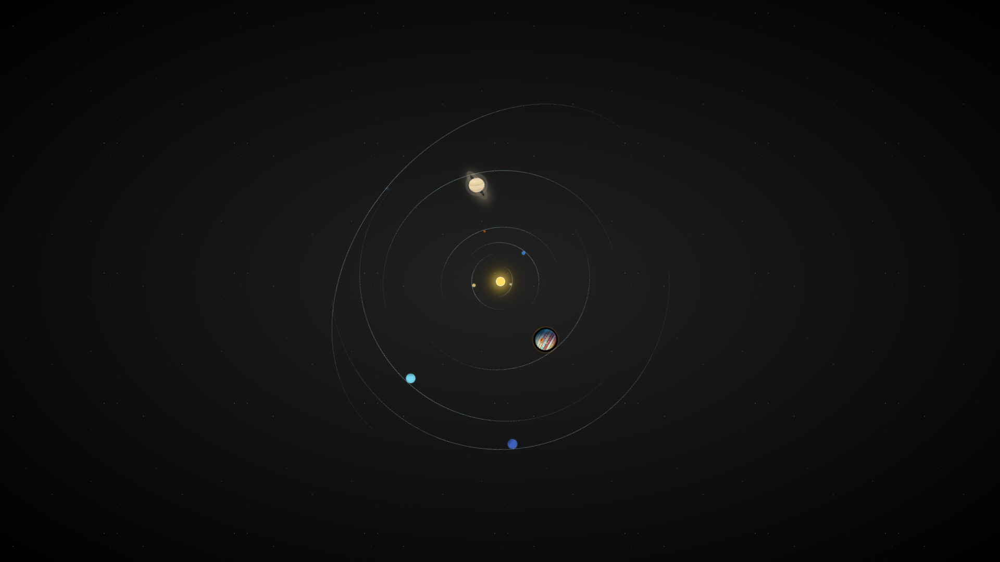
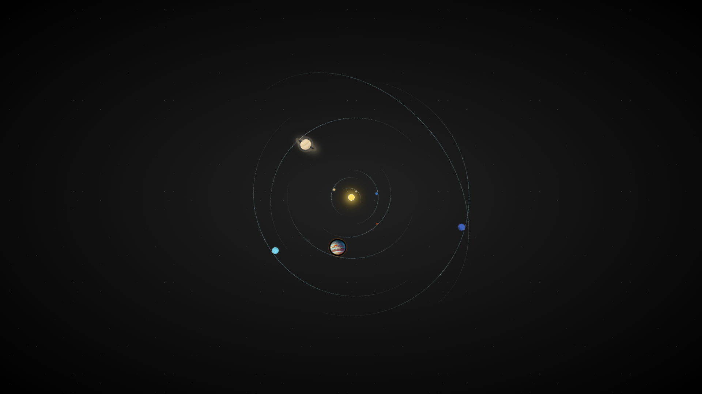

# Solar System CSS Demo

**Demo of our solar system with relative orbital speed and path.  
This demo is purely written in HTML5 and CSS.**

## Overview

This project visually simulates the planets of our solar system orbiting the sun, using only HTML5 and CSS.  
It demonstrates relative orbital speeds, elliptical orbits, and planet sizes for an educational and visually appealing effect.

## Features

- Realistic orbital periods and eccentricities
- Scaled planet sizes and orbits (for display)
- Animated orbits using CSS keyframes
- Photo-realistic textures for Jupiter and Saturn
- Responsive, full-window starfield background
- No JavaScript required

## Screenshots

## Usage

1. Clone or download this repository.
2. Open [`index.html`](index.html) in your web browser.

## File Structure

- [`index.html`](index.html): Main HTML file
- [`assets/css/styles.scss`](assets/css/styles.scss): Main SCSS source for solar system styles
- [`assets/css/styles.min.css`](assets/css/styles.min.css): Compiled and minified CSS
- [`assets/img/`](assets/img/): Planet textures (Jupiter, Saturn)
- [`_Screenshots/`](./_Screenshots/): Example screenshots

## License

This project is open source for non-commercial use only.  
See [`LICENSE.txt`](LICENSE.txt) for details.

## Credits

- Planet textures: NASA (public domain)
- CSS/HTML: Demo by SonicBoyBlu

---

_Enjoy exploring our solar system in CSS!_
