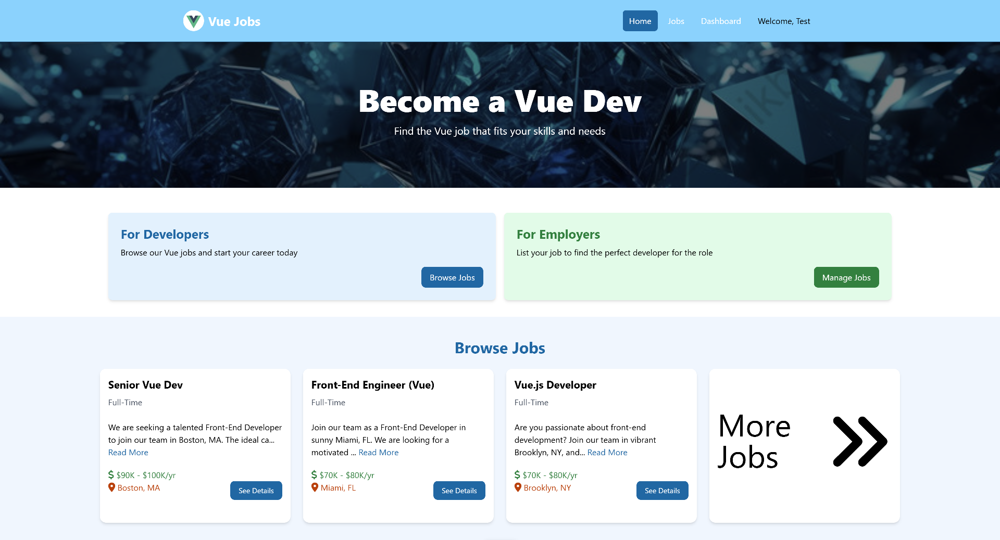
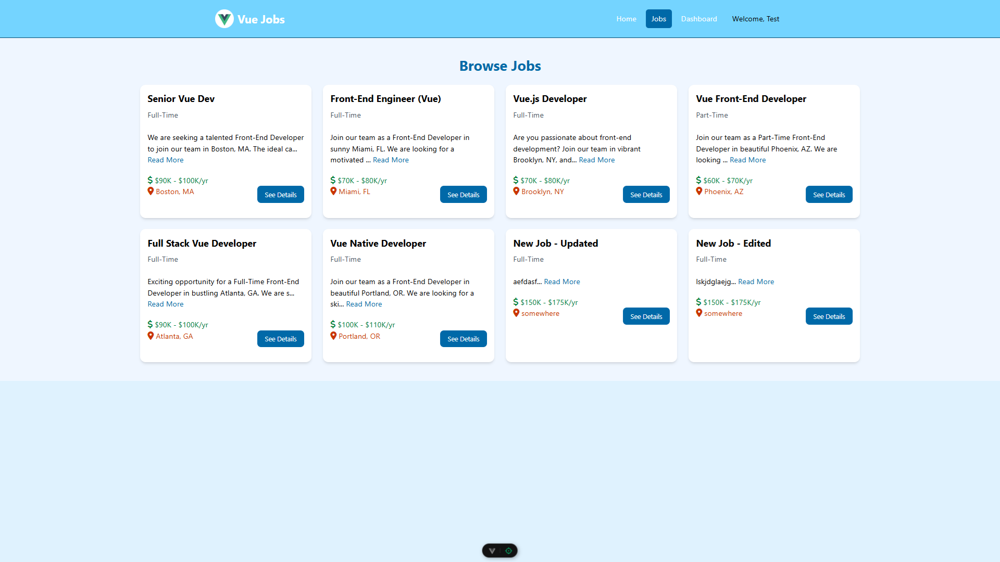
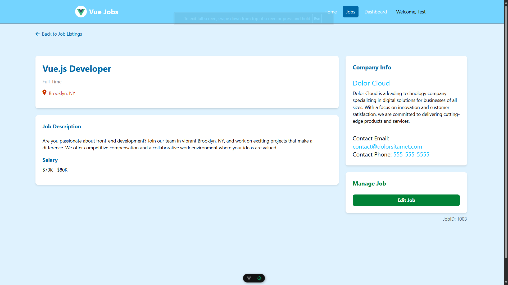

# Vue Jobs Board

A modern job board application built with Vue 3, Vite, Tailwind CSS, and Vuex.

## Live Demo

Check out the live demo:  
👉 [https://main.d1s9mwdqfzhl92.amplifyapp.com/](https://main.d1s9mwdqfzhl92.amplifyapp.com/)

## Screenshots

### Home Page

### Job Listings

### Job Detail

### Job Modify

## License

This project is released under the [CC0 License](license.txt).
