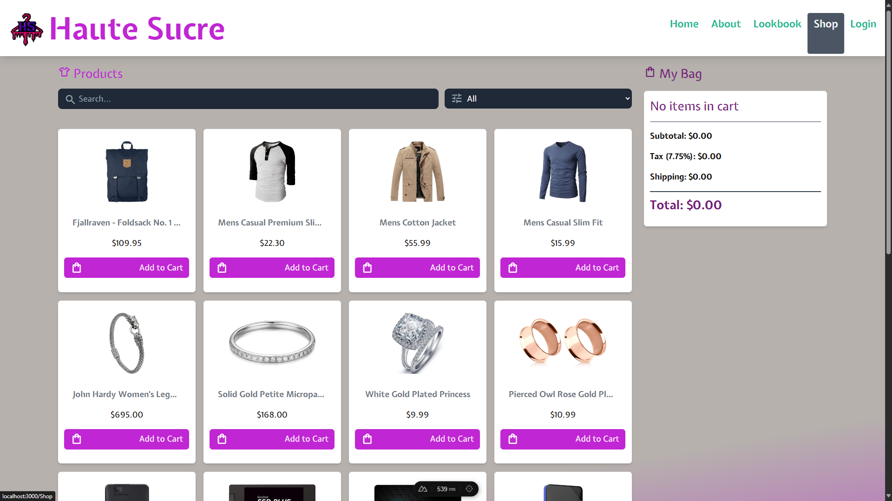
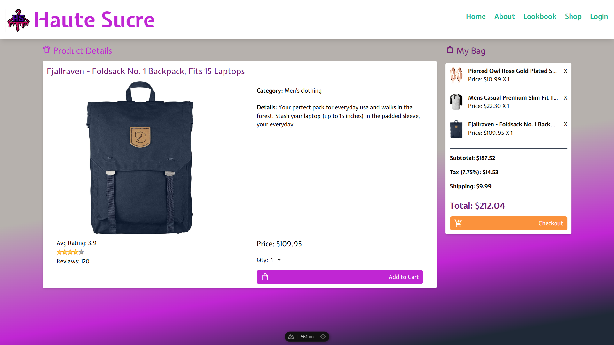
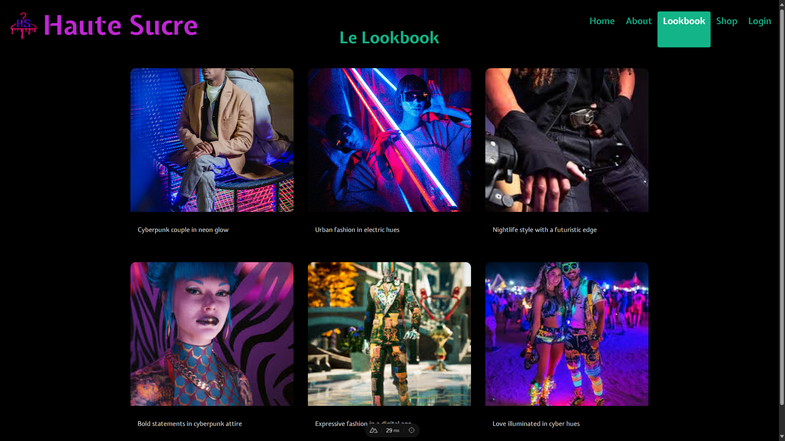
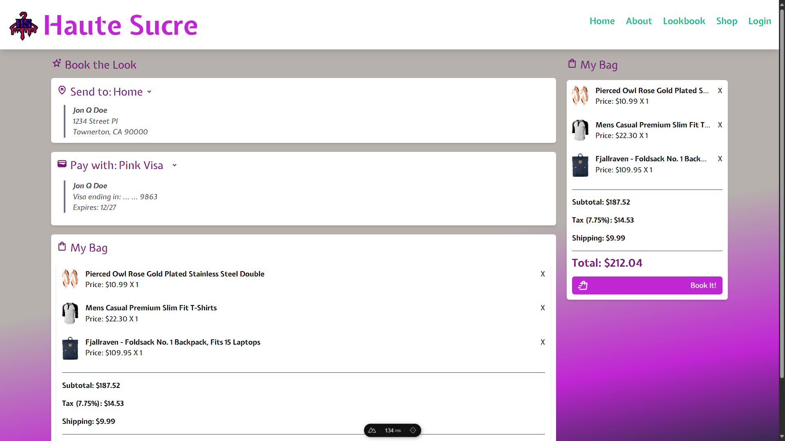
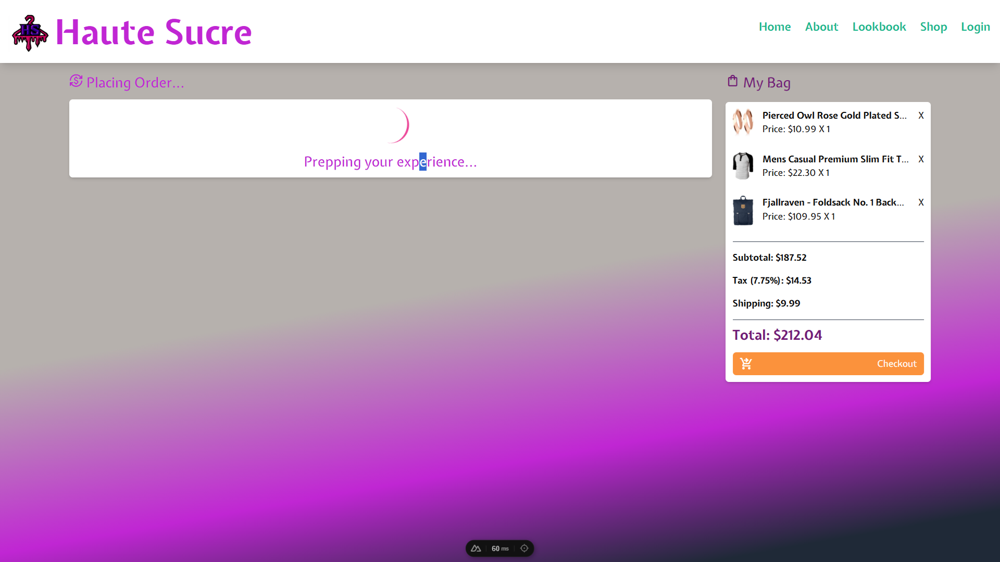
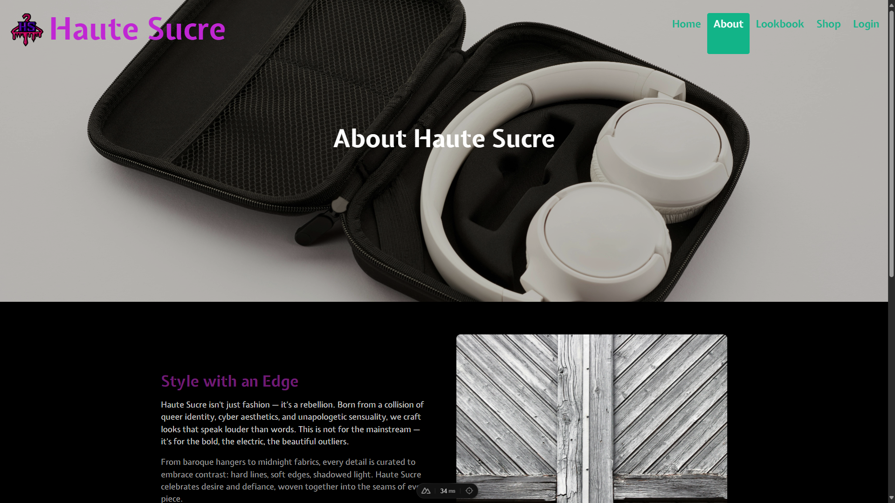

# Haute Sucre – Nuxt 3 Shopping Demo

A modern, cyberpunk-inspired shopping demo built with Nuxt 3 and FakeStoreAPI.

## Live Demo

👉 [View the Live Demo](https://master.d10ym6o28kp1nb.amplifyapp.com/)

---

## Screenshots

| Home                                    | Shop                                    | Item Detail                                    |
| --------------------------------------- | --------------------------------------- | ---------------------------------------------- |
|  |  |  |

| Lookbook                                    | Checkout                                    | Checkout Processing                                    | About                                    |
| ------------------------------------------- | ------------------------------------------- | ------------------------------------------------------ | ---------------------------------------- |
|  |  |  |  |

---

## Features

- Nuxt 3 + TypeScript
- FakeStoreAPI integration
- Modern UI with Tailwind CSS
- Product search, categories, and detail pages
- Cart, checkout, and order history
- Responsive and mobile-friendly

---

## Setup

Install dependencies:

```sh
npm install
```
